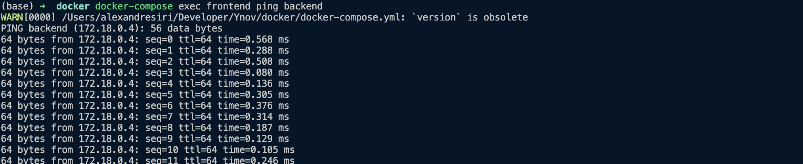
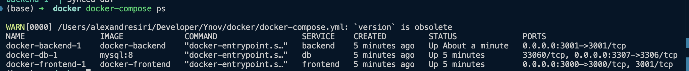
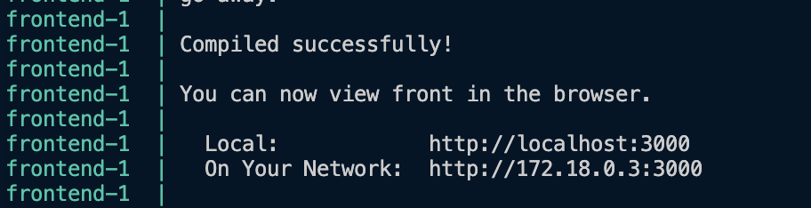

# Étape 1:  Création des Dockerfiles

On a créé les dockerfile dans le front et le back une fois cela fait nous les avont démarrés
avec la commmande:  docker-compose up --build

## Étape 2 : Gestion de la persistance des données

Nous avons crée manuellemment le volume avec la commande docker volume create mysql_data_housing
on peut voir que cela a bien marché on voit bien mysql_data_housing lorsque l'on utilise docker volume ls

On a verifié que le volume était bien monté avec docker-compose exec db ls -la /var/lib/mysql

## Étape 3 : Mise en réseau des conteneurs
On a crée un réseau on relié a ce réseau la partie back la partie front et la bdd ce qui leur permet de communiquer directmeent entre eux docker fournit une résolution dns.

## Étape 4 : Test et validation

